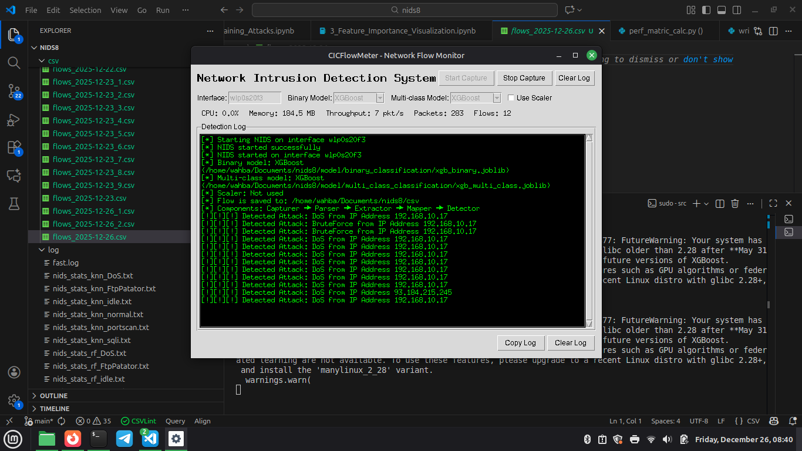
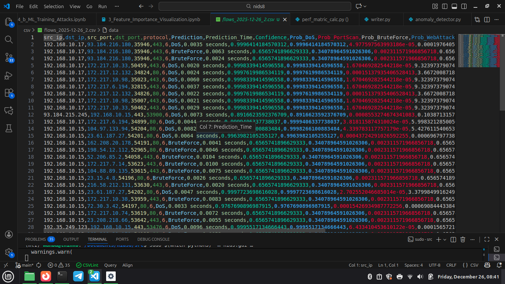

# NIDS8: Network Intrusion Detection System

A lightweight ml-based anomaly based NIDS for end devices using machine learning

- Real-time network traffic capture and parsing
- Feature extraction for network flows (packet count, byte count, timing, flags, etc.)
- Machine learning-based anomaly and attack detection (binary and multi-class)
- Extensible feature engineering pipeline
- CSV logging and statistics output
- Tkinter-based GUI for live monitoring and control
- Modular codebase for easy extension and experimentation

## Project Structure

```
nids8/
|-- src/nids/           # Core NIDS source code
|    |-- main.py        # Main NIDS pipeline (capture, parse, extract, detect)
|    |-- gui.py         # Tkinter GUI for monitoring
|    |-- anomaly_detector.py  # ML-based anomaly/attack detection
|    |-- feature_extractor.py # Feature extraction logic
|    |-- feature_mapper.py    # Feature mapping utilities
|    |-- packet_capturer.py   # Live packet capture
|    |-- packet_parser.py     # Packet parsing
|    |-- helper/              # Utility modules
|         |-- features/       # Feature calculation modules
|         |-- other/          # Constants, flow, writer, utils
|-- model/              # Pre-trained ML models
|    |-- binary_classification/
|    |-- multi_class_classification/
|-- csv/                # Input/output CSVs, flow logs
|-- log/                # Detection and statistics logs
|-- demo/               # Demo images (GUI, alerts, logs)
|-- notebook/           # Jupyter notebooks for data analysis
|-- requirements.txt    # Python dependencies
|-- environment.yml     # Conda environment
|-- README.md           # Project documentation
```


## Model Files

Pre-trained machine learning models are required for detection. Download the models from Kaggle and place them in the appropriate subfolders under `model/`:

- Download from: [https://www.kaggle.com/models/wahbakamaluddin/nids7](https://www.kaggle.com/models/wahbakamaluddin/nids7)
- Place binary classification models in `model/binary_classification/`
- Place multi-class classification models in `model/multi_class_classification/`
- Place scalers in `model/binary_classification/` or as instructed in the notebook/code

The folder structure should look like:

```
model/
  binary_classification/
    <binary_model_files>
    <scaler_files>
  multi_class_classification/
    <multi_class_model_files>
```

Continue with the installation steps below after placing the models.

### Using Conda (Recommended)

```bash
conda env create -f environment.yml
conda activate nids8
```

### Using pip

```bash
pip install -r requirements.txt
```

## Usage

### 1. Run the GUI

```bash
python -m src.nids.gui
```

### 2. Run the NIDS pipeline (headless)

```bash
python -m src.nids.main --interface <network_interface>
```

### 3. Data Analysis & Notebooks

See the `notebook/` folder for Jupyter notebooks on preprocessing, feature importance, and ML training.

## Input/Output

- **Input:** Live network traffic or CSV files
- **Output:**
  - Detection results and statistics in `log/`
  - Processed flows in `csv/`

## Extending & Customizing

- Add new features: Implement in `src/nids/helper/features/`
- Add/replace ML models: Update `anomaly_detector.py` and model files
- Modify GUI: Edit `src/nids/gui.py`


## Notebooks Overview

The `notebook/` directory contains Jupyter notebooks for each stage of the NIDS8 pipeline:

- **1_Data_Preprocessing.ipynb**: Covers the preprocessing steps for network flow data, including loading, cleaning, and preparing the data for feature extraction and machine learning. It is the first step in the NIDS8 pipeline and ensures data quality for subsequent analysis.
- **2_a_Feature_Importance_Benign_Attack.ipynb**: Analyzes feature importance for distinguishing between benign and attack network flows. It uses machine learning models to identify which features are most relevant for binary classification.
- **2_b_Feature_Importance_Attacks_.ipynb**: Investigates feature importance for differentiating between various attack types. It applies multi-class classification models to highlight features that best separate different attack categories.
- **3_a_ML_Training_Benign_Attack.ipynb**: Trains and evaluates machine learning models for binary classification of network flows (benign vs attack). It includes model selection, training, validation, and performance analysis.
- **3_b_ML_Training_Attacks.ipynb**: Focuses on training and evaluating machine learning models for multi-class classification of attack types. It covers model training, validation, and performance metrics for distinguishing between different attacks.
- **4_Feature_Importance_Visualization.ipynb**: Visualizes the feature importance results from previous analyses. It provides graphical representations to help interpret which features are most significant for attack detection and classification.

## Demo

See `demo/` for screenshots:
- 
- 
- 

## License

MIT License. See LICENSE file if present.

## Authors

See project contributors or contact the repository owner.
